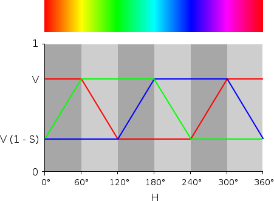

# Breathing LED

#### Project description

For this project, you should implement the 2 modules specified. The 'pwm_generator' module should
implement a pwm output in a pretty straightforward way as described by the comments in that file.

The 'led_breather' module should act as a top-level FPGA module taking in a clock signal from the
board and outputting a signal to the red LED (`led_rgb_o[0]`) to make it appear to "breathe". The intensity of the LED should start at 0 and slowly ramp up to a higher value before decreasing again.

You can do this by starting the PWM generator at 0 and slowly increasing its value to a maximum before slowly decreasing it again.

##### Extra credit

The onboard LED is in fact RGB. To make this project more interesting, you can drive all 3 LED in such a way that you can cycle through all hues. You just need to dim red, green, and blue like so:

(originally published by https://academe.co.uk)

To save your eyeballs, you may want the max brightness to be less than a 100% duty cycle.

You should spin through the whole hue cycle once about every 3 seconds to achieve a pleasing effect.

#### Testbench

Writing a testbench is left as an exercise to the reader for this project. For the testbench, you may want to speed up the hue cycle by a few thousand times. Simulating more than about 100 milliseconds - especially with iverilog and gtkwave - is a massive pain.

#### iCESugar pins

The iCESugar dev board has a red, green, and blue LED hooked up to pins 40, 41, and 39 of the iCE40
FPGA. These outputs are **active low**.

In order to enable the LEDs, you'll need to make sure that J6 has all of its jumpers attached. The board should have come with all the jumpers in this default configuration.

TODO: Images

The iCESugar dev board also has a 12MHz clock signal that goes into the FPGA.

#### Synthesis files

To synthesize a bitfile that goes onto the iCESugar board, you can go into the `synth` folder and run `build.sh`.

The following files in the `synthesis` folder work together to produce `proj.bin`, the file that you put onto the FPGA.
 - `pins.pcf`
   This tells the synthesis tool which physical pins on the FPGA go to which ports on the top-level module. It also tells the synthesis tools what frequency input clocks are.
   In this design, there's 1 12MHz clock input and 3 LED pins

 - `synth.yosys`
   This file tells the synthesis tool which files should be synthesized. `yosys` takes this in as a script and
   outputs a `json` file which is a version of your circuit built entirely of iCE40 primitives.

 - `build.sh`
   This script runs `yosys` to synthesize your design, `nextpnr-ice40` to place and route your design, and `icepack` to
   convert the fully routed design to a bitstream for the FPGA.

#### Programming the iCESugar

Please check out the example project `../examples/` for info about how to get the resulting bitfile onto the iCESugar FPGA board.
